<!-- _class: title -->
<!-- _paginate: false -->
<!-- _header: "" -->
<!-- _footer: "" -->

# mermaid 図を含むプレゼンテーション

### ビルドスクリプトによる自動 SVG 変換のデモ

---

## システム構成図

- mermaid で記述した図を **事前に SVG に変換**して埋め込み
- `bg right contain` でスライド右側に配置
- `diagramPadding` で余白を自動付与

---

## mermaid ファイルの命名規則

| ファイル | 役割 |
|---|---|
| `example-mermaid.md` | Markdown 本体 |
| `example-mermaid_flowchart.mmd` | mermaid ソース |
| `example-mermaid_flowchart.svg` | ビルド時に自動生成 |

> `{mdのベース名}_{図の名前}.mmd` の命名規則に従うと、ビルドスクリプトが自動検出して SVG に変換します。

---

<!-- _class: title -->
<!-- _paginate: false -->
<!-- _header: "" -->
<!-- _footer: "" -->

# Thank You
