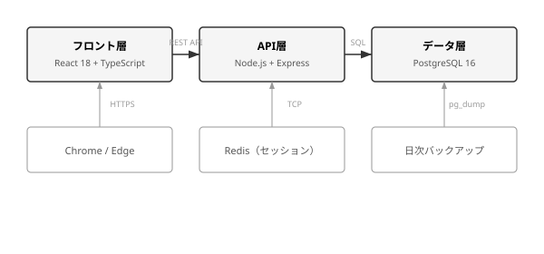

<!-- _class: title -->
<!-- _paginate: skip -->
<!-- _header: "" -->
<!-- _footer: "" -->

# サンプルシステム外部設計書

## サンプル機能部

第 1.0 版　2026年2月15日

### サンプル株式会社

---

<!-- _paginate: skip -->
<!-- _header: "<a href='#改版履歴'>改版履歴</a>" -->

# 改版履歴

| 版数 | 改版概要                                     | 改版日     | 改版者   |
| ---- | -------------------------------------------- | ---------- | -------- |
| 0.1  | 初稿作成                                     | 2026/01/15 | 鈴木花子 |
| 0.2  | レビュー指摘反映（画面遷移図修正）           | 2026/01/22 | 鈴木花子 |
| 0.9  | セキュリティ要件追加、バリデーション仕様修正 | 2026/02/05 | 鈴木花子 |
| 1.0  | 正式版発行                                   | 2026/02/15 | 山田太郎 |

---

<!-- _paginate: skip -->
<!-- _header: "<a href='#目次'>目次</a>" -->

# 目次

<div class="toc">

- [1. はじめに](#1-はじめに)
  - [1.1. 本書の目的](#11-本書の目的)
  - [1.2. 関連ドキュメント](#12-関連ドキュメント)
  - [1.3. 用語定義](#13-用語定義)
- [2. システム概要](#2-システム概要)
  - [2.1. システム構成](#21-システム構成)
  - [2.2. 開発スケジュール](#22-開発スケジュール)
- [3. 外部設計](#3-外部設計)
  - [3.1. 顧客データ入力画面](#31-顧客データ入力画面)
  - [3.2. 社内データ更新画面](#32-社内データ更新画面)
  - [3.3. セキュリティ情報確認画面](#33-セキュリティ情報確認画面)
- [4. 非機能要件](#4-非機能要件)
  - [4.1. 性能要件](#41-性能要件)
  - [4.2. 可用性要件](#42-可用性要件)
  - [4.3. セキュリティ要件](#43-セキュリティ要件)
  - [4.4. 運用・保守要件](#44-運用保守要件)

</div>

---

<!-- _header: "<a href='#1-はじめに'>1. はじめに</a><a href='#11-本書の目的'>1.1. 本書の目的</a>" -->

# 1. はじめに

## 1.1. 本書の目的

本書は、サンプルシステムにおけるサンプル機能部の外部設計を定義する。画面仕様、入出力仕様、業務ルール、および関連する非機能要件について記述する。

本書の読者として、以下の関係者を想定する。

- **発注者** — 株式会社サンプル　情報システム部
- **開発者** — サンプル株式会社　開発チーム
- **運用者** — 株式会社サンプル　運用管理チーム

> 本書の記載内容について疑義が生じた場合は、システム概要仕様書（SD-001）の定義を優先する。なお、各画面の詳細な内部処理については、別途、内部設計書にて定義する。

## 1.2. 関連ドキュメント

<div class="caption">表1.1　関連ドキュメント一覧</div>

| ドキュメント ID | ドキュメント名        | 版数 | 備考             |
| --------------- | --------------------- | ---- | ---------------- |
| SD-001          | システム概要仕様書    | 2.0  | 上位ドキュメント |
| SD-002          | システム構造設計書    | 1.1  | 上位ドキュメント |
| ED-001          | 外部設計書 共通機能部 | 1.0  | 関連設計書       |
| ED-003          | 外部設計書 帳票出力部 | 0.9  | ドラフト         |

---

<!-- _header: "<a href='#1-はじめに'>1. はじめに</a><a href='#13-用語定義'>1.3. 用語定義</a>" -->

## 1.3. 用語定義

本書で使用する主要な用語を以下に定義する。

<div class="def">

### 顧客データ

取引先の企業情報・担当者情報・契約情報を総称したデータをいう。

### マスタデータ

部門コード・商品コード等、システム全体で共通に参照される基盤データをいう。

### バッチ処理

日次または月次で定期実行されるデータ集計・連携処理をいう。

### SLA（Service Level Agreement）

可用性・応答時間等のサービス品質に関する合意事項をいう。本書では第4章にて定義する。

</div>

---

<!-- _header: "<a href='#2-システム概要'>2. システム概要</a><a href='#21-システム構成'>2.1. システム構成</a>" -->

# 2. システム概要

## 2.1. システム構成

本システムは、フロント層・API層・データ層の3層アーキテクチャで構成する。各層の技術要素および役割を表2.1に示す。

<div class="caption">表2.1　システム構成</div>

<div class="auto">

| 層         | 技術要素              | 役割                                                    |
| ---------- | --------------------- | ------------------------------------------------------- |
| フロント層 | React 18 + TypeScript | SPA構成。API層とREST APIで通信する                      |
| API層      | Node.js + Express     | ステートレスなREST APIを提供する。認証はJWTトークン方式 |
| データ層   | PostgreSQL 16         | トランザクションデータとマスタデータを同一DBで管理      |

</div>



<div class="caption">図2.1　システム構成図</div>

動作保証対象ブラウザはデスクトップ版Chrome・Edgeの最新2バージョンとする。レスポンシブデザインは対象外とする。

<div class="note">

**注記**
本システムではモバイル端末からの利用を想定しない。将来的にモバイル対応を行う場合は、別途フロント層の追加開発が必要となる。

</div>

---

<!-- _header: "<a href='#2-システム概要'>2. システム概要</a><a href='#22-開発スケジュール'>2.2. 開発スケジュール</a>" -->

## 2.2. 開発スケジュール

各フェーズの期間と主要成果物を表2.2に示す。

<div class="caption">表2.2　開発スケジュール</div>

| フェーズ               | 期間               | 主要成果物                     |
| ---------------------- | ------------------ | ------------------------------ |
| 要件定義・基本設計     | 2026/01 〜 2026/02 | 要件定義書、基本設計書         |
| 詳細設計・実装         | 2026/03 〜 2026/05 | 詳細設計書、ソースコード       |
| 結合テスト・受入テスト | 2026/06            | テスト報告書、受入確認書       |
| 本番リリース・運用開始 | 2026/07            | リリース手順書、運用マニュアル |

結合テストの完了判定基準は、テスト項目の消化率100%かつ重大障害（Severity A・B）の残存ゼロとする。受入テストは発注者側の主導で実施し、受入確認書をもって本フェーズの完了とする。

---

<!-- _header: "<a href='#3-外部設計'>3. 外部設計</a><a href='#31-顧客データ入力画面'>3.1. 顧客データ入力画面</a>" -->

# 3. 外部設計

本章では、サンプル機能部を構成する各画面の外部設計を定義する。画面ごとに、画面概要・入力項目・バリデーション仕様・処理仕様・エラーメッセージを記述する。

## 3.1. 顧客データ入力画面

### 画面概要

顧客の基本情報（企業名・住所・連絡先）および担当者情報を登録・更新する画面である。新規登録モードと編集モードを持ち、URLパラメータにより切り替える。

<div class="caption">表3.1　画面基本情報</div>

| 項目         | 内容                            |
| ------------ | ------------------------------- |
| 画面ID       | SCR-CUS-001                     |
| 画面名       | 顧客データ入力                  |
| アクセス権限 | 営業部、管理者                  |
| 遷移元       | 顧客一覧画面（SCR-CUS-000）     |
| 遷移先       | 顧客詳細画面、顧客一覧画面      |
| HTTPメソッド | GET（表示）/ POST（登録・更新） |

---

<!-- _header: "<a href='#3-外部設計'>3. 外部設計</a><a href='#31-顧客データ入力画面'>3.1. 顧客データ入力画面</a><span>入力項目一覧</span>" -->

### 入力項目一覧

<div class="caption">表3.2　入力項目一覧</div>

| No. | 項目名     | 項目ID       | 型       | 桁数 | 必須 | 備考                     |
| --- | ---------- | ------------ | -------- | ---- | ---- | ------------------------ |
| 1   | 企業名     | company_name | 文字列   | 100  | ○    | 全角・半角混在可         |
| 2   | 企業名カナ | company_kana | 文字列   | 200  | ○    | 全角カタカナのみ         |
| 3   | 郵便番号   | zip_code     | 文字列   | 8    | ○    | ハイフン付き（999-9999） |
| 4   | 都道府県   | prefecture   | コード   | 2    | ○    | 都道府県マスタ参照       |
| 5   | 住所       | address      | 文字列   | 200  | ○    | 市区町村以降             |
| 6   | 電話番号   | phone        | 文字列   | 15   | −    | ハイフン付き             |
| 7   | メール     | email        | 文字列   | 256  | −    | RFC 5322 準拠            |
| 8   | 担当者名   | contact_name | 文字列   | 50   | ○    | 姓と名をスペース区切り   |
| 9   | 備考       | remarks      | テキスト | 1000 | −    | 自由入力                 |

---

<!-- _header: "<a href='#3-外部設計'>3. 外部設計</a><a href='#31-顧客データ入力画面'>3.1. 顧客データ入力画面</a><span>バリデーション仕様</span>" -->

### バリデーション仕様

各入力項目に対するバリデーションルールを以下に定義する。バリデーションはフロント側で即時チェックを行い、API側でも同一ルールで再検証する。

**(1) 企業名カナ**
全角カタカナ（ア〜ン）、長音符（ー）、全角スペースのみ許可する。
正規表現: `^[ァ-ヶー　]+$`

**(2) 郵便番号**
ハイフン付き7桁形式のみ許可する。入力後にハイフンなしでDBに格納する。
正規表現: `^\d{3}-\d{4}$`

**(3) メールアドレス**
RFC 5322に準拠した形式であること。ドメイン部のMXレコード検証は行わない。

**(4) 電話番号**
ハイフン区切りの数字列であること。国際番号（+81始まり）も許可する。
正規表現: `^[\d\-\+]+$`

<div class="note">

**注記**
郵便番号から住所を自動補完する機能を設ける。外部APIとして日本郵便の郵便番号検索APIを利用する。API障害時は手動入力にフォールバックする。

</div>

---

<!-- _header: "<a href='#3-外部設計'>3. 外部設計</a><a href='#31-顧客データ入力画面'>3.1. 顧客データ入力画面</a><span>処理仕様</span>" -->

### 処理仕様

**新規登録時の処理フロー**

1. ユーザーがフォームに顧客情報を入力し、「確認」ボタンを押下する
2. フロント側でバリデーションを実行し、エラーがあればフォーム上部にメッセージを表示する
3. 確認画面に遷移し、入力内容を読み取り専用で表示する
4. 「登録」ボタン押下で `POST /api/customers` を呼び出す
5. API側でバリデーション・重複チェックを実行し、DBにINSERTする
6. 完了画面を表示し、5秒後に顧客一覧画面へ自動遷移する

**編集時の処理フロー**

1. 顧客詳細画面から「編集」ボタンを押下する（`?id={customer_id}` パラメータ付与）
2. `GET /api/customers/{id}` で既存データを取得し、フォームに初期値をセットする
3. 以降の処理は新規登録時と同一とする（APIは `PUT /api/customers/{id}` を使用）

> 確認画面で「戻る」を押した場合は入力画面に遷移し、入力内容を保持する。セッションタイムアウト（30分）が発生した場合は、ログイン画面にリダイレクトする。

---

<!-- _header: "<a href='#3-外部設計'>3. 外部設計</a><a href='#31-顧客データ入力画面'>3.1. 顧客データ入力画面</a><span>エラーメッセージ一覧</span>" -->

### エラーメッセージ一覧

<div class="caption">表3.3　エラーメッセージ一覧（顧客データ入力画面）</div>

| コード    | メッセージ                                       | 発生条件                 |
| --------- | ------------------------------------------------ | ------------------------ |
| E-CUS-001 | 企業名は必須です                                 | 企業名が未入力           |
| E-CUS-002 | 企業名カナは全角カタカナで入力してください       | カナ以外の文字を含む     |
| E-CUS-003 | 郵便番号の形式が正しくありません（例: 100-0001） | 郵便番号が形式不正       |
| E-CUS-004 | メールアドレスの形式が正しくありません           | メールアドレスが形式不正 |
| E-CUS-005 | 同一企業名が既に登録されています                 | 企業名の重複チェック     |
| E-CUS-006 | 登録処理に失敗しました。再度お試しください       | DB書き込みエラー         |

---

<!-- _header: "<a href='#3-外部設計'>3. 外部設計</a><a href='#32-社内データ更新画面'>3.2. 社内データ更新画面</a>" -->

## 3.2. 社内データ更新画面

### 画面概要

社内で管理する部門情報・社員情報のマスタデータを更新する画面である。部門マスタと社員マスタの2つのタブで構成する。

<div class="caption">表3.4　画面基本情報</div>

| 項目         | 内容                      |
| ------------ | ------------------------- |
| 画面ID       | SCR-MST-001               |
| 画面名       | 社内データ更新            |
| アクセス権限 | 総務部、管理者            |
| 遷移元       | 管理メニュー画面          |
| 遷移先       | 管理メニュー画面          |
| HTTPメソッド | GET / POST / PUT / DELETE |

### 部門マスタ項目

<div class="caption">表3.5　部門マスタ項目一覧</div>

| No. | 項目名     | 項目ID        | 型     | 桁数 | 必須 | 備考                 |
| --- | ---------- | ------------- | ------ | ---- | ---- | -------------------- |
| 1   | 部門コード | dept_code     | 文字列 | 10   | ○    | 英数字のみ、一意制約 |
| 2   | 部門名     | dept_name     | 文字列 | 50   | ○    | —                    |
| 3   | 上位部門   | parent_code   | 文字列 | 10   | −    | 部門マスタの自己参照 |
| 4   | 有効開始日 | valid_from    | 日付   | −    | ○    | YYYY/MM/DD形式       |
| 5   | 有効終了日 | valid_to      | 日付   | −    | −    | 未指定時は無期限     |
| 6   | 表示順     | display_order | 数値   | 5    | −    | 一覧画面でのソート順 |

---

<!-- _header: "<a href='#3-外部設計'>3. 外部設計</a><a href='#32-社内データ更新画面'>3.2. 社内データ更新画面</a><span>業務ルール</span>" -->

### 業務ルール

**登録・更新時**

- 部門コードは登録後に変更不可とする
- 上位部門に自身を指定することは不可とする（循環参照の防止）
- 有効終了日は有効開始日より後の日付であること
- 同一部門コードが既に存在する場合は、エラーメッセージ E-DEPT-001 を返す

**削除時**

- 物理削除は行わず、論理削除とする（`deleted_at` カラムに日時をセット）
- 配下に所属する社員が1名以上存在する場合は削除不可とし、エラーメッセージ E-DEPT-003 を返す
- 削除済みデータは管理者ロールを持つユーザーのみ参照可能とする

### API仕様

<div class="caption">表3.6　部門マスタAPI一覧</div>

| メソッド | エンドポイント              | 説明         | 備考                                        |
| -------- | --------------------------- | ------------ | ------------------------------------------- |
| GET      | /api/departments            | 部門一覧取得 | `include_deleted=true` で削除済みも取得可能 |
| POST     | /api/departments            | 部門新規登録 | リクエストボディにJSON形式で送信            |
| PUT      | /api/departments/:dept_code | 部門情報更新 | 部門コードは変更不可                        |
| DELETE   | /api/departments/:dept_code | 部門論理削除 | 配下社員が存在する場合は409を返す           |

---

<!-- _header: "<a href='#3-外部設計'>3. 外部設計</a><a href='#32-社内データ更新画面'>3.2. 社内データ更新画面</a><span>レスポンス形式</span>" -->

### レスポンス形式

正常時と異常時のレスポンス形式を以下に示す。

**正常時（200 OK）**

```json
{
  "status": "success",
  "data": {
    "dept_code": "SALES-01",
    "dept_name": "営業第一部",
    "parent_code": "SALES",
    "valid_from": "2026-04-01"
  }
}
```

**異常時（409 Conflict）**

```json
{
  "status": "error",
  "error": {
    "code": "E-DEPT-003",
    "message": "配下の社員が存在するため削除できません"
  }
}
```

<div class="column">

### レスポンス設計の方針

すべてのAPIレスポンスは `status` フィールドを持ち、`"success"` または `"error"` の値を取る。異常時は `error` オブジェクト内にコード・メッセージを格納する。この形式は ED-001 共通機能部で定義されたAPI共通仕様に準拠する。

</div>

---

<!-- _header: "<a href='#3-外部設計'>3. 外部設計</a><a href='#33-セキュリティ情報確認画面'>3.3. セキュリティ情報確認画面</a>" -->

## 3.3. セキュリティ情報確認画面

### 画面概要

ログインユーザーのセキュリティ関連情報を確認する画面である。以下の3つのタブで構成する。

<div class="caption">表3.7　タブ構成</div>

| タブ名               | 表示内容                                                           |
| -------------------- | ------------------------------------------------------------------ |
| ログイン履歴         | 直近30日間のIPアドレス、ブラウザ情報、ログイン日時の一覧           |
| パスワード変更履歴   | 変更日時と変更方法（自主変更 / 管理者リセット）の一覧              |
| アクティブセッション | 現在有効なセッション一覧。現在のセッション以外を強制ログアウト可能 |

不審なログイン（通常と異なるIPアドレス帯や海外からのアクセス）が検出された場合は、該当行を赤色で警告表示する。パスワードの最終変更日から90日以上経過している場合は、画面上部に変更を促すメッセージを表示する。

---

<!-- _header: "<a href='#3-外部設計'>3. 外部設計</a><a href='#33-セキュリティ情報確認画面'>3.3. セキュリティ情報確認画面</a><span>セキュリティポリシー</span>" -->

### セキュリティポリシー

**パスワード要件**

<div class="caption">表3.8　パスワードポリシー</div>

| 項目                 | 要件                         |
| -------------------- | ---------------------------- |
| 最小文字数           | 12文字以上                   |
| 最大文字数           | 128文字以下                  |
| 英大文字             | 1文字以上必須                |
| 英小文字             | 1文字以上必須                |
| 数字                 | 1文字以上必須                |
| 記号                 | 1文字以上必須                |
| 過去パスワード再利用 | 直近5回分は使用不可          |
| 有効期限             | 90日（期限切れ後に強制変更） |

**アカウントロック**

<div class="caption">表3.9　アカウントロックポリシー</div>

| 項目       | 要件                               |
| ---------- | ---------------------------------- |
| ロック条件 | 連続5回の認証失敗                  |
| ロック時間 | 30分間（自動解除）                 |
| 管理者解除 | 管理画面から即時解除可能           |
| ロック通知 | メールで本人および管理者に通知する |

---

<!-- _header: "<a href='#3-外部設計'>3. 外部設計</a><a href='#33-セキュリティ情報確認画面'>3.3. セキュリティ情報確認画面</a>" -->

**セッション管理**

<div class="caption">表3.10　セッション管理ポリシー</div>

| 項目                   | 要件                                                |
| ---------------------- | --------------------------------------------------- |
| セッション有効期限     | 30分（操作なし時に自動タイムアウト）                |
| 最大同時セッション     | 3セッションまで（超過時は最古のセッションを無効化） |
| セッション延長         | ユーザー操作のたびに有効期限をリセットする          |
| セッション固定攻撃対策 | ログイン成功時にセッションIDを再生成する            |

> セッション情報はサーバーサイドのRedisに保持し、JWTのペイロードにはセッションIDのみを含める。JWTの有効期限はセッション有効期限と一致させ、リフレッシュトークン方式は採用しない。

---

<!-- _header: "<a href='#4-非機能要件'>4. 非機能要件</a><a href='#41-性能要件'>4.1. 性能要件</a>" -->

# 4. 非機能要件

## 4.1. 性能要件

<div class="caption">表4.1　性能要件</div>

| 指標          | 目標値                                |
| ------------- | ------------------------------------- |
| 画面応答時間  | 通常操作で3秒以内（95パーセンタイル） |
| APIレスポンス | GET: 500ms以内、POST/PUT: 1,000ms以内 |
| 同時接続数    | 最大100ユーザーの同時アクセスに対応   |
| バッチ処理    | 日次バッチは午前6時までに完了すること |

## 4.2. 可用性要件

<div class="caption">表4.2　可用性要件</div>

| 項目         | 要件                                                           |
| ------------ | -------------------------------------------------------------- |
| 稼働率       | 99.5%（月間ダウンタイム3.6時間以内）                           |
| 計画停止     | 月1回、第2日曜日 02:00〜06:00（4時間以内）                     |
| 障害復旧目標 | RTO: 4時間以内、RPO: 1時間以内                                 |
| バックアップ | 日次フルバックアップ（7世代保持）+ WALアーカイブによるPITR対応 |

---

<!-- _header: "<a href='#4-非機能要件'>4. 非機能要件</a><a href='#43-セキュリティ要件'>4.3. セキュリティ要件</a>" -->

## 4.3. セキュリティ要件

本システムにおけるセキュリティ対策の方針を以下に定義する。

- 通信は全てTLS 1.2以上で暗号化すること
- パスワードはbcrypt（コストファクター12）でハッシュ化して保存すること
- APIエンドポイントに対してCSRFトークンによる検証を行うこと
- SQLインジェクション対策として、全てのクエリにプリペアドステートメントを使用すること
- XSS対策として、出力時にHTMLエスケープ処理を行うこと
- ファイルアップロード機能においては、拡張子・MIMEタイプの検証とウイルススキャンを実施すること

<div class="note">

**注記**
脆弱性診断は結合テストフェーズにおいて外部ベンダーに委託して実施する。診断結果に基づく是正措置は、本番リリースまでに完了させること。

</div>

---

<!-- _header: "<a href='#4-非機能要件'>4. 非機能要件</a><a href='#44-運用保守要件'>4.4. 運用・保守要件</a>" -->

## 4.4. 運用・保守要件

本システムの運用・保守に関する要件を以下に定義する。運用体制の構築にあたっては、発注者側の情報システム部と開発者側の運用チームが連携し、SLAに基づく安定的なサービス提供を目指す。

障害発生時の初動対応は運用チームが担当し、原因調査および恒久対策は開発チームと協議の上で実施する。なお、重大障害（Severity A）については、発生から30分以内に関係者への一次連絡を行うこととする。

定期メンテナンスは月1回の計画停止枠内で実施する。OSパッチ適用、ミドルウェアのアップデート、および証明書の更新作業が主な対象となる。緊急性の高いセキュリティパッチについては、計画停止枠外での臨時メンテナンスを実施する場合がある。

### 監視項目

システムの安定稼働を維持するために、以下の監視を実施する。

- **インフラ監視** — CPU使用率、メモリ使用率、ディスク使用率を5分間隔で取得する
- **アプリケーション監視** — エラーレート、レスポンスタイム、スループットを1分間隔で取得する
- **ログ監視** — エラーログ、セキュリティログをリアルタイムで監視し、異常パターン検出時にアラートを発報する
- **外形監視** — ヘルスチェックエンドポイントへの定期アクセスにより、サービスの死活監視を行う

### 障害対応フロー

障害検知からサービス復旧までの対応手順を以下に定める。

1. 監視システムがアラートを検知し、運用チームのSlackチャネルに通知する
2. 運用担当者が30分以内に障害の影響範囲を確認し、一次報告を行う
3. Severity判定を実施し、対応優先度を決定する
4. 原因切り分けを行い、必要に応じて開発チームにエスカレーションする
5. 暫定対策を実施し、サービスを復旧する
6. 恒久対策を立案し、次回リリースで対応する
7. 障害報告書を作成し、関係者に共有する

### ログ保存ポリシー

各種ログの保存期間を以下のとおり定める。

- アプリケーションログ — 90日間（オンライン30日 + アーカイブ60日）
- アクセスログ — 1年間
- セキュリティログ（認証・認可） — 3年間
- 監査ログ — 5年間（法令要件に基づく）
