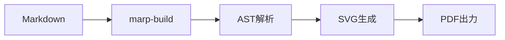
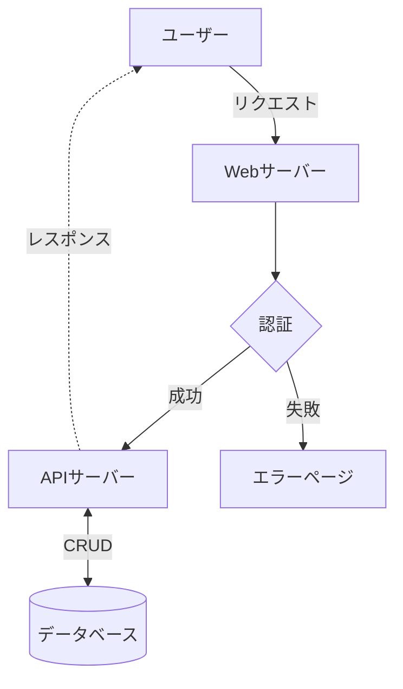

<!-- _class: title -->
<!-- _paginate: false -->
<!-- _header: "" -->
<!-- _footer: "" -->

# mermaid 図を含むプレゼンテーション

### ビルドスクリプトによる自動 SVG 変換のデモ

---

## システム構成図

- mermaid で記述した図を **事前に SVG に変換**して埋め込み
- 外部 `.mmd` ファイルもインライン mermaid も同じように表示

---

## mermaid ファイルの命名規則

| ファイル                             | 役割               |
| ------------------------------------ | ------------------ |
| `rooster-blue-mermaid.md`            | Markdown 本体      |
| `rooster-blue-mermaid_flowchart.mmd` | mermaid ソース     |
| `rooster-blue-mermaid_flowchart.svg` | ビルド時に自動生成 |

> `{mdのベース名}_{図の名前}.mmd` の命名規則に従うと、ビルドスクリプトが自動検出して SVG に変換します。

---

## インライン mermaid（自動変換）

- Markdown 内に直接記述した mermaid コードブロックも **自動で SVG に変換**
- 外部 `.mmd` ファイルと共存可能

---

## インライン（２） mermaid（自動変換）

- Markdown 内に直接記述した mermaid コードブロックも **自動で SVG に変換**
- 外部 `.mmd` ファイルと共存可能

---

<!-- _class: title -->
<!-- _paginate: false -->
<!-- _header: "" -->
<!-- _footer: "" -->

# Thank You
